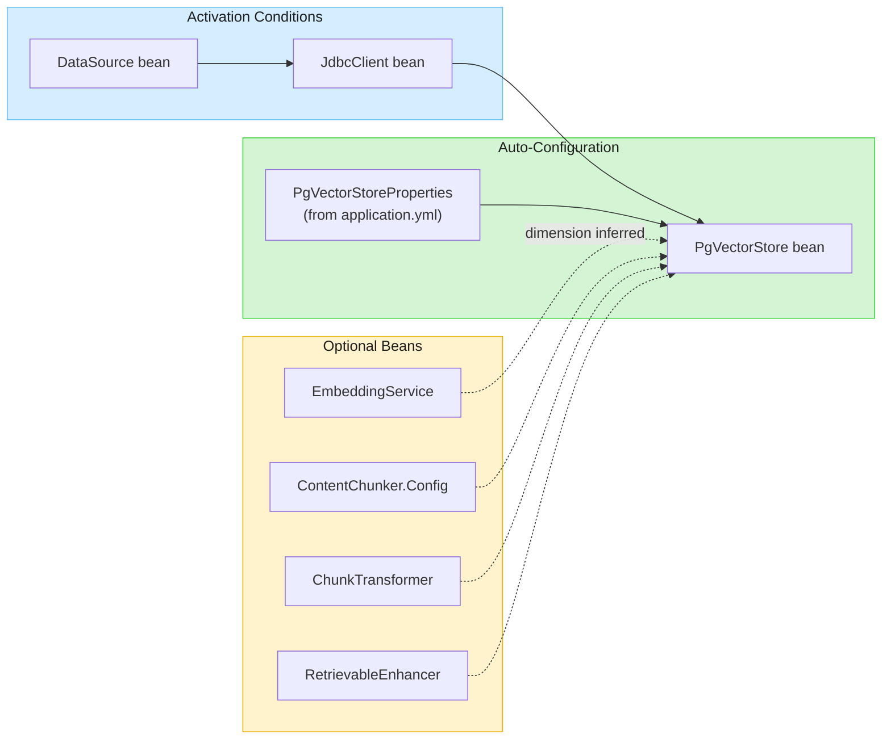
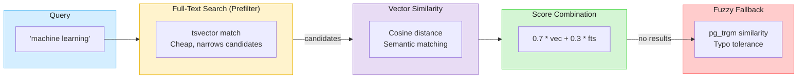

&nbsp;

# Embabel RAG PgVector

PostgreSQL-based RAG (Retrieval-Augmented Generation) vector store using [pgvector](https://github.com/pgvector/pgvector) for hybrid search.

Part of the [Embabel Agent RAG framework](https://docs.embabel.com/embabel-agent/guide/0.3.3-SNAPSHOT/#reference.rag), providing a consistent API alongside other stores like Lucene and Neo4j.

## Features

| Feature | Description |
|---------|-------------|
| **Vector Similarity** | Semantic search via pgvector using cosine distance |
| **Full-Text Search** | PostgreSQL tsvector/tsquery with normalized scoring |
| **Fuzzy Matching** | Trigram similarity via pg_trgm for typo-tolerant search |
| **Hybrid Search** | Weighted combination of vector + lexical results |
| **Auto-Configuration** | Spring Boot auto-configuration with sensible defaults |
| **Dimension Inference** | Automatically infers embedding dimension from EmbeddingService |

## Quick Start

### 1. Start PostgreSQL

```bash
docker compose up -d
```

This starts PostgreSQL 17 with pgvector and pg_trgm extensions.

**Connection details:**
| Property | Value |
|----------|-------|
| Host | `localhost` |
| Port | `5432` |
| Database | `embabel_rag` |
| Username | `embabel` |
| Password | `embabel` |

### 2. Add Dependency

```xml
<dependency>
    <groupId>com.embabel.agent</groupId>
    <artifactId>embabel-agent-rag-pgvector</artifactId>
    <version>${embabel.version}</version>
</dependency>
```

### 3. Configure

```yaml
spring:
  datasource:
    url: jdbc:postgresql://localhost:5432/embabel_rag
    username: embabel
    password: embabel

embabel.rag.pgvector:
  name: my-rag-store
```

That's it! The store auto-configures when a `DataSource` is available.

## Auto-Configuration

PgVectorStore auto-configures when the following conditions are met:

| Condition | Description |
|-----------|-------------|
| `DataSource` bean present | Standard Spring datasource configuration |
| `JdbcClient` created | Auto-created from DataSource if not present |

### What Gets Auto-Configured



### Disabling Auto-Configuration

```yaml
spring:
  autoconfigure:
    exclude:
      - com.embabel.agent.rag.pgvector.PgVectorAutoConfiguration
```

## Usage

### With Auto-Configuration (Recommended)

Simply inject the auto-configured store:

```kotlin
@Service
class MySearchService(
    private val pgVectorStore: PgVectorStore
) {
    fun search(query: String): List<SimilarityResult<Chunk>> {
        return pgVectorStore.textSearch(
            TextSimilaritySearchRequest(query, topK = 10, similarityThreshold = 0.5),
            Chunk::class.java
        )
    }
}
```

### With Builder API

For programmatic configuration:

```kotlin
val store = PgVectorStore.builder()
    .withDataSource(dataSource)
    .withEmbeddingService(embeddingService)  // dimension auto-inferred
    .withName("my-rag-store")
    .withHybridWeights(0.7, 0.3)
    .build()

val results = store.hybridSearch(
    TextSimilaritySearchRequest("machine learning", topK = 10),
    Chunk::class.java
)
```

### Text-Only Search (No Embeddings)

For text search without vector similarity:

```kotlin
val store = PgVectorStore.builder()
    .withDataSource(dataSource)
    .withName("text-only-store")
    .withEmbeddingDimension(1536)  // required without EmbeddingService
    .build()

val results = store.textSearch(
    TextSimilaritySearchRequest("machine learning", topK = 10, similarityThreshold = 0.5),
    Chunk::class.java
)
```

## Integration with ToolishRag

PgVectorStore implements `SearchOperations`, making it a drop-in replacement for other stores like Lucene or Neo4j with [ToolishRag](https://docs.embabel.com/embabel-agent/guide/0.3.3-SNAPSHOT/#reference.rag).

### Basic Setup

```java
// Create the store (auto-configured or via builder)
PgVectorStore pgVectorStore = PgVectorStore.builder()
    .withDataSource(dataSource)
    .withEmbeddingService(embeddingService)
    .withName("policies")
    .build();

// Wrap in ToolishRag for LLM tool access
ToolishRag policiesRag = new ToolishRag(
    "policies",
    "Company policies and procedures for answering user questions",
    pgVectorStore
);

// Use in LLM calls
context.ai()
    .withLlm(chatLlm)
    .withReference(policiesRag)
    .respondWithSystemPrompt(conversation, Map.of());
```

### With Multi-Tenant Filtering

```java
// Scope searches to current user's data
ToolishRag scopedRag = policiesRag.withMetadataFilter(
    PropertyFilter.eq("tenantId", currentTenant.getId())
);
```

### Exposed Tools

Based on PgVectorStore's capabilities, ToolishRag automatically exposes:

| Tool | Description |
|------|-------------|
| `{name}_vectorSearch` | Semantic similarity search via pgvector |
| `{name}_textSearch` | Full-text search via PostgreSQL tsvector |

The LLM autonomously decides which tool to use based on the user's query.

## Search Strategies

### Hybrid Search

Combines vector similarity and full-text search with configurable weights:



### Score Normalization

Text search scores are normalized to match vector similarity ranges (0-1):

| Raw ts_rank | Normalized Score | Interpretation |
|-------------|------------------|----------------|
| 0.10 | 0.30 | Weak match |
| 0.20 | 0.60 | Moderate match |
| 0.25 | 0.75 | Good match |
| 0.33+ | 1.00 | Excellent match |

This allows using consistent thresholds (e.g., 0.7) across both text and vector search.

## Configuration Properties

| Property | Default | Description |
|----------|---------|-------------|
| `embabel.rag.pgvector.name` | `pgvector-store` | Store instance name |
| `embabel.rag.pgvector.content-element-table` | `content_elements` | Table name |
| `embabel.rag.pgvector.schema-name` | `public` | PostgreSQL schema |
| `embabel.rag.pgvector.embedding-dimension` | `1536` | Vector dimension (auto-inferred from EmbeddingService) |
| `embabel.rag.pgvector.vector-weight` | `0.7` | Hybrid search vector weight |
| `embabel.rag.pgvector.fts-weight` | `0.3` | Hybrid search FTS weight |
| `embabel.rag.pgvector.fuzzy-threshold` | `0.2` | Minimum trigram similarity |

## Docker Compose

The included `docker-compose.yml` provides a ready-to-use PostgreSQL instance:

```yaml
services:
  postgres:
    image: pgvector/pgvector:pg17
    environment:
      POSTGRES_DB: embabel_rag
      POSTGRES_USER: embabel
      POSTGRES_PASSWORD: embabel
    ports:
      - "5432:5432"
    volumes:
      - pgvector_data:/var/lib/postgresql/data
      - ./init-extensions.sql:/docker-entrypoint-initdb.d/init-extensions.sql:ro
```

### Commands

```bash
# Start
docker compose up -d

# Logs
docker compose logs -f postgres

# Stop
docker compose down

# Stop and remove data
docker compose down -v
```

## SQL Externalization

All SQL queries are externalized to `src/main/resources/sql/` for easy customization:

```
sql/
├── ddl/                    # Schema creation
│   ├── create-table.sql
│   ├── create-tsv-trigger.sql
│   └── create-index-*.sql
├── queries/                # Search queries
│   ├── text-search.sql
│   ├── vector-search.sql
│   ├── hybrid-search.sql
│   └── fuzzy-search.sql
└── operations/             # CRUD operations
    ├── save-element.sql
    └── delete-root-and-descendants.sql
```

## Acknowledgments

Hybrid search architecture inspired by [Josh Long's](https://joshlong.com) article
[Building a Hybrid Search Engine with PostgreSQL and JDBC](https://joshlong.com/jl/blogPost/building-a-search-engine-with-postgresql-and-jdbc.html).

## License

Apache License 2.0
